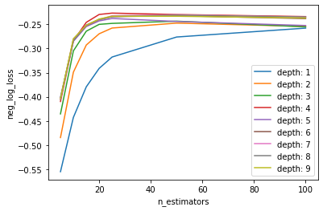

```{r setup, include=FALSE}
knitr::opts_chunk$set(echo = TRUE)

def.chunk.hook  <- knitr::knit_hooks$get("chunk")
knitr::knit_hooks$set(chunk = function(x, options) {
  x <- def.chunk.hook(x, options)
  ifelse(options$size != "normalsize", paste0("\n \\", options$size,"\n\n", x, "\n\n \\normalsize"), x)
})
```

```{r logo, eval=TRUE, echo=FALSE, message=FALSE, fig.align='center', out.width='0.3\\linewidth', fig.pos='H'}
temp <- tempfile(fileext = ".pdf")
download.file(url = "https://reproducible-agile.github.io/public/images/reproducible-AGILE-logo-square.pdf", destfile = temp)
knitr::include_graphics(temp)
```

This report is part of the reproducibility review at the AGILE conference.
For more information see [https://reproducible-agile.github.io/](https://reproducible-agile.github.io/).
This document is published on OSF at [https://osf.io/wncsm/](https://osf.io/wncsm/).
To cite the report use

Koukouraki, E. (2022, June).  Reproducibility review of: Traffic Regulation Recognition using Crowd-Sensed GPS and Map Data: a Hybrid Approach. [https://doi.org/10.17605/OSF.IO/WNCSM](https://doi.org/10.17605/OSF.IO/WNCSM)

# Reviewed paper

Zourlidou, S., Golze, J., and Sester, M.: Traffic Regulation Recognition using Crowd-Sensed GPS and Map Data: a Hybrid Approach, AGILE GIScience Ser., 3, 22, https://doi.org/10.5194/agile-giss-3-22-2022

# Summary

The paper compares several models for traffic control recognition at junctions, which are built upon Random Forest and Gradient Boosting classifiers. The analysis makes use of 2 datasets, which correspond to the cities of Chicago and Hannover. The first dataset was published previously by Ahmed et al. (2014) and was made publicly available for the needs of this study through this link: [https://drive.google.com/file/d/1GHtPpyoziF3hMV_LtyvTfnIBRQ8BdX_e/edit](https://drive.google.com/file/d/1GHtPpyoziF3hMV_LtyvTfnIBRQ8BdX_e/edit). The data for Hannover were collected by the authors of the paper (as mentioned in Subsection 3.1) and have not been made openly available yet. The code were the analysis was based on, was also declared as intellectual property and thus, it is not publicly shared. However, the authors agreed to share confidentially all their materials with the Reproducibility Committee for the needs of the review. For the needs of this review, we reproduced all the Tables and Figures of *Section 5 - Results* and of the Appendix. The outcome of the review was discussed with the authors to resolve any dissimilarities and eventually the reproduced results were in accordance with the final uploaded version of the manuscript. Therefore, the reproduction of the paper is considered **successful**.

\clearpage

# Reproducibility reviewer notes

The implementation of the analysis is based on a PostgreSQL database with a PostGIS extension and on Jupyter notebooks. The PostgreSQL database holds the data that needs to be accessed and processed during various steps of the computational analysis, which is implemented entirely on Jupyter notebooks. In order to properly recreate the pipeline, detailed instructions about the installation of the necessary software were provided by the authors. The exact versions of the tools/environments that were used are listed below:
- Windows 10 OS
- pgAdmin4 6.8
- PostgreSQL 13.7
- PostGIS 3.1.4
- Anaconda Navigator 2.1.1
- Jupyter Notebook 6.4.11
- Python 3.9.12

The pipeline of the workflow was not hard to reproduce. The authors took a couple of weeks to organize the materials properly and eventually responded with elaborate instructions that were easy to follow. The notebooks were structured in a sensible way that matches the way the results are presented in the paper and the reproduced figures and numbers were explicitly corresponding with the paper. A list of Python packages was not included in the materials. All the necessary Python packages were installed using Anaconda navigator, unless indicated otherwise by the instructions.

### Reproduced figures

All the reproduced figures are listed below:

```{r, echo=FALSE,out.width="22%",fig.cap="Corresponds to Figure 5 of the reproduced paper",fig.show='hold',fig.align='center'}
knitr::include_graphics(c(c('./reproduced/Figure5a-SimplifiedRFHannover.png','./reproduced/Figure5b-DefaultRFHannover.png', './reproduced/Figure5c-SimplifiedGBHannover.png', './reproduced/Figure5d-DefaultGBHannover.png'),                       c('./reproduced/Figure5e-SimplifiedRFChicago.png','./reproduced/Figure5f-DefaultRFChicago.png', './reproduced/Figure5g-SimplifiedGBChicago.png', './reproduced/Figure5h-DefaultGBChicago.png')))
```
```{r, echo=FALSE,out.width="22%",fig.cap="Corresponds to Figure 6 of the reproduced paper",fig.show='hold',fig.align='center'}
knitr::include_graphics(c('./reproduced/Figure6a-DynamicRFHannover.png','./reproduced/Figure6b-DynamicGBHannover.png', './reproduced/Figure6c-DynamicRFChicago.png', './reproduced/Figure6d-DynamicGBChicago.png'))
```

```{r, echo=FALSE,out.width="25%",fig.cap="Corresponds to Figure 7 of the reproduced paper",fig.show='hold',fig.align='center'}
knitr::include_graphics(c('./reproduced/Figure7a.png','./reproduced/Figure7b.png'))
```

```{r, echo=FALSE,out.width="90%",fig.cap="Corresponds to Figure 8 of the reproduced paper",fig.show='hold',fig.align='center'}
knitr::include_graphics(c('./reproduced/Figure8a.png','./reproduced/Figure8b.png'))
```

```{r, echo=FALSE,out.width="50%",fig.cap="Corresponds to Figure 9 of the reproduced paper",fig.show='hold',fig.align='center'}

```

```{r, echo=FALSE,out.width="25%",fig.cap="Corresponds to Figure 10 of the reproduced paper",fig.show='hold',fig.align='center'}
knitr::include_graphics(c('./reproduced/Figure10a-Exp4.png','./reproduced/Figure10b-Exp8.png'))
```

```{r, echo=FALSE,out.width="25%",fig.cap="Corresponds to Figure 10 of the reproduced paper",fig.show='hold',fig.align='center'}
knitr::include_graphics(c('./reproduced/Figure10a-Exp4.png','./reproduced/Figure10b-Exp8.png'))
```

```{r, echo=FALSE,out.width="40%",fig.cap="Corresponds to Figure A1 of the reproduced paper",fig.show='hold',fig.align='center'}
knitr::include_graphics(c(c('./reproduced/FigureA1a-SimplifiedGBHannover.png','./reproduced/FigureA1b-DefaultGBHannover.png'),           c('./reproduced/FigureA1c-SimplifiedRFChicago.png','./reproduced/FigureA1d-DefaultRFChicago.png')))
```
```{r, echo=FALSE,out.width="40%",fig.cap="Corresponds to Figure C1 of the reproduced paper",fig.show='hold',fig.align='center'}
knitr::include_graphics(c(c('./reproduced/FigureC1a-DynamicRFHannover.png','./reproduced/FigureC1b-DynamicGBHannover.png'),           c('./reproduced/FigureC1c-DynamicRFChicago.png','./reproduced/FigureC1d-DynamicGBChicago.png')))
```

```{r, echo=FALSE,out.width="40%",fig.cap="Corresponds to Figure E1 of the reproduced paper",fig.show='hold',fig.align='center'}
knitr::include_graphics(c('./reproduced/FigureE1a-Exp4.png','./reproduced/FigureE1b-Exp8.png'))
```
### Reproduced tables

All the of the reproduced tables (namely Table 2, 3, 4, A1, B1 and D1) required combining the results of several different Jupyter notebooks in a manual fashion. Below are showcased the different chunks that correspond to the results presented in the paper's Tables in the form of screenshots:

```{r, echo=FALSE,out.width="40%",fig.cap="Corresponds to Table 2 and Table A1 of the reproduced paper",fig.show='hold',fig.align='center'}
knitr::include_graphics(c('./reproduced/Table2-TableA1-DefaultGBChicago.png','./reproduced/Table2-TableA1-DefaultGBHannover.png', './reproduced/Table2-TableA1-DefaultRFChicago.png', './reproduced/Table2-TableA1-DefaultRFHannover.png', './reproduced/Table2-TableA1-SimplifiedGBChicago.png','./reproduced/Table2-TableA1-SimplifiedGBHannover.png', './reproduced/Table2-TableA1-SimplifiedRFChicago.png', './reproduced/Table2-TableA1-SimplifiedRFHannover.png'))
```


```{r, echo=FALSE,out.width="40%",fig.cap="Corresponds to Table 3 and Table D1 of the reproduced paper",fig.show='hold',fig.align='center'}
knitr::include_graphics(c('./reproduced/Table3-TableB1-DynamicGBChicago.png','./reproduced/Table3-TableB1-DynamicGBHannover.png', './reproduced/Table3-TableB1-DynamicRFChicago.png', './reproduced/Table3-TableB1-DynamicRFHannover.png'))
```


```{r, echo=FALSE,out.width="40%",fig.cap="Corresponds to Table 4 and Table D1 of the reproduced paper",fig.show='hold',fig.align='center'}
knitr::include_graphics(c('./reproduced/Table4-TableD1-Exp1.png','./reproduced/Table4-TableD1-Exp2.png', './reproduced/Table4-TableD1-Exp3.png', './reproduced/Table4-TableD1-Exp4.png', './reproduced/Table4-TableD1-Exp5.png','./reproduced/Table4-TableD1-Exp6.png', './reproduced/Table4-TableD1-Exp7.png', './reproduced/Table4-TableD1-Exp8.png'))
```


```{r, echo=FALSE, eval=FALSE, results='hide'}
# create ZIP of reproduction files and upload to OSF
library("zip")
library("here")

zipfile <- here::here("PATH/agile-reproreview-YEAR-NUMBER.zip")
file.remove(zipfile)
zip::zipr(zipfile,
          here::here("2020-018/files to add to the zip, if any"))

library("osfr") # See docs at https://docs.ropensci.org/osfr/
# OSF_PAT is in .Renviron in parent directory
# We cannot use osfr to create a new component (with osfr::osf_create_component(x = osfr::osf_retrieve_node("6k5fh"), ...) because that will set the storage location to outside Europe.

# retrieve project
project <- osfr::osf_retrieve_node("OSF ID")

# upload files
osfr::osf_upload(x = project,
                 conflicts = "overwrite",
                 path = c(list.files(here::here("PATH"),
                                     pattern = "agile-reproreview-.*(pdf$|Rmd$|zip$)",
                                     full.names = TRUE),
                          "COPYRIGHT"
                          )
                 )
```