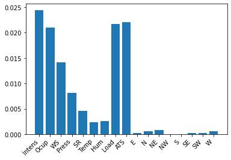
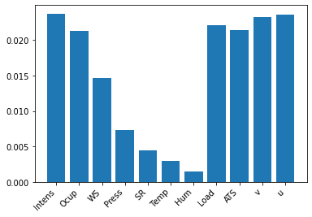

```{r setup, include=FALSE}
knitr::opts_chunk$set(echo = TRUE)

def.chunk.hook  <- knitr::knit_hooks$get("chunk")
knitr::knit_hooks$set(chunk = function(x, options) {
  x <- def.chunk.hook(x, options)
  ifelse(options$size != "normalsize", paste0("\n \\", options$size,"\n\n", x, "\n\n \\normalsize"), x)
})
```

```{r logo, eval=TRUE, echo=FALSE, message=FALSE, fig.align='center', out.width='0.3\\linewidth', fig.pos='H'}
temp <- tempfile(fileext = ".pdf")
download.file(url = "https://reproducible-agile.github.io/public/images/reproducible-AGILE-logo-square.pdf", destfile = temp)
knitr::include_graphics(temp)
```

This report is part of the reproducibility review at the AGILE conference.
For more information see [https://reproducible-agile.github.io/](https://reproducible-agile.github.io/).
This document is published on OSF at [https://osf.io/wncsm/](https://osf.io/w7vph/).
To cite the report use

Koukouraki, E. (2022, June).  Reproducibility review of: Exploratory Analysis and Feature Selection for the Prediction of Nitrogen Dioxide.  [https://doi.org/10.17605/OSF.IO/WNCSM](https://doi.org/10.17605/OSF.IO/W7VPH)

# Reviewed paper

Iskandaryan, D., Di Sabatino, S., Ramos, F., and Trilles, S.: Exploratory Analysis and Feature Selection for the Prediction of Nitrogen Dioxide, AGILE GIScience Ser., 3, 6, [https://doi.org/10.5194/agile-giss-3-6-2022](https://doi.org/10.5194/agile-giss-3-6-2022)

# Summary

The paper evaluates the competence of selected features in the prediction of Nitrogen Dioxide with Machine Learning. For this reproduciblity review, the Figures and Tables of *Section 5 - Experiments and Results* were considered, while the Figures of *Section 3 - Exploratory Analysis* were not. The code of the corresponding analysis can be found in the following archived Github repository: [https://github.com/reproducible-agile/ExploratoryAnalysis_FeatureSelection](https://github.com/reproducible-agile/ExploratoryAnalysis_FeatureSelection). The data that is necessary to run the code can be found in the following Zenodo repository: [https://zenodo.org/record/6543074](https://zenodo.org/record/6543074). The reproduced results were in accordance with the ones reported in the paper, so the **reproduction** of the paper is considered **successful**.


\clearpage

# Reproducibility reviewer notes

The code for the reproduction of the paper's analysis was provided as a Github repository in the *Data and Software Availability* Section of the paper and the necessary data to run the code was provided as a Zenodo repository in the README of the aforementioned Github repository. The link to the datasets is the following [https://zenodo.org/record/6543074](https://zenodo.org/record/6543074). After the reproducibility review, the Github repository was forked and archived under the official Reproducible AGILE Github organization. 

The implementation of the analysis is handled mainly by 2 Jupyter notebooks, which were executed in the environment of Google Colaboratory ([https://colab.research.google.com/](https://colab.research.google.com/)). The data had to be either uploaded manually or externally mounted. The latter required the modification of the corresponding paths in the code. In order to reproduce all the reported results, we had to manipulate the code by commenting and uncommenting different chunks, something that is not ideal. Furthermore, previous experience with the Keras API was necessary in order to figure out how the manipulation should be properly handled. Instructions on how to use the notebooks were not provided with the README.

In order to eliminate any uncertainty that is induced by training Machine Learning models with early stopping callback, the authors were encouraged to provide the models that they had already trained, as well as the training weights. Eventually, the authors provided both the trained models and the code for training new ones for the needs of the reproducibility review.

### Reproduced figures

The reproduced figures (Figure 13 and 14) deviate slightly from ones in the paper, but the differences were considered of minor importance, since they do not affect the outcome of this stage of the analysis. The reproduced figures were created using the following Jupyter notebook [https://github.com/reproducible-agile/ExploratoryAnalysis_FeatureSelection/blob/main/Mutual_Information.ipynb](https://github.com/reproducible-agile/ExploratoryAnalysis_FeatureSelection/blob/main/Mutual_Information.ipynb) and they are demonstrated below:

```{r, echo=FALSE,out.width="50%",fig.cap="Corresponds to Figure 13 of the reproduced paper",fig.show='hold',fig.align='center'}

```

```{r, echo=FALSE,out.width="50%",fig.cap="Corresponds to Figure 14 of the reproduced paper",fig.show='hold',fig.align='center'}

```

### Reproduced tables

The reproduced tables (Table 2, 3 and 4) were created using the following Jupyter notebook.  [https://github.com/reproducible-agile/ExploratoryAnalysis_FeatureSelection/blob/main/BiConvLSTM.ipynb](https://github.com/reproducible-agile/ExploratoryAnalysis_FeatureSelection/blob/main/BiConvLSTM.ipynb). The creation required to manipulate and rerun the code and then combine the results in a manual fashion. Below are showcased the different screenshots that were collected throughout this process:


```{r, echo=FALSE,out.width="35%",fig.cap="Corresponds to Table 2 of the reproduced paper",fig.show='hold',fig.align='center', nCol = 2,}
knitr::include_graphics(c(c('./reproduced/Table2_ScenarioI_AllFeatures.png','./reproduced/Table2_ScenarioI_MI.png'), c('./reproduced/Table2_ScenarioII_AllFeatures.png', './reproduced/Table2_ScenarioII_MI.png')))
```

```{r, echo=FALSE,out.width="50%",fig.cap="Corresponds to Table 3 of the reproduced paper",fig.show='hold',fig.align='center', nCol=1}
knitr::include_graphics(c('./reproduced/Table3_K3.png','./reproduced/Table3_K4.png', './reproduced/Table3_K5.png', './reproduced/Table3_K6.png', './reproduced/Table3_K7.png', './reproduced/Table3_K8.png'))
```

```{r, echo=FALSE,out.width="50%",fig.cap="Corresponds to Table 4 of the reproduced paper",fig.show='hold',fig.align='center', nCol=1}
knitr::include_graphics(c('./reproduced/Table4_K3.png','./reproduced/Table4_K4.png', './reproduced/Table4_K5.png', './reproduced/Table4_K6.png', './reproduced/Table4_K7.png', './reproduced/Table4_K8.png'))
```


```{r, echo=FALSE, eval=FALSE, results='hide'}
# create ZIP of reproduction files and upload to OSF
library("zip")
library("here")

zipfile <- here::here("PATH/agile-reproreview-YEAR-NUMBER.zip")
file.remove(zipfile)
zip::zipr(zipfile,
          here::here("2020-018/files to add to the zip, if any"))

library("osfr") # See docs at https://docs.ropensci.org/osfr/
# OSF_PAT is in .Renviron in parent directory
# We cannot use osfr to create a new component (with osfr::osf_create_component(x = osfr::osf_retrieve_node("6k5fh"), ...) because that will set the storage location to outside Europe.

# retrieve project
project <- osfr::osf_retrieve_node("OSF ID")

# upload files
osfr::osf_upload(x = project,
                 conflicts = "overwrite",
                 path = c(list.files(here::here("PATH"),
                                     pattern = "agile-reproreview-.*(pdf$|Rmd$|zip$)",
                                     full.names = TRUE),
                          "COPYRIGHT"
                          )
                 )
```