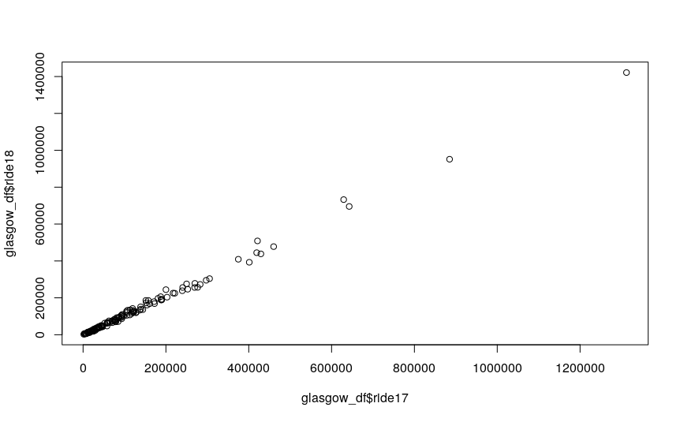
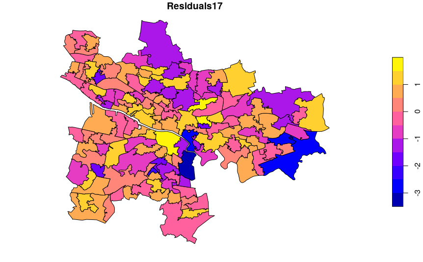
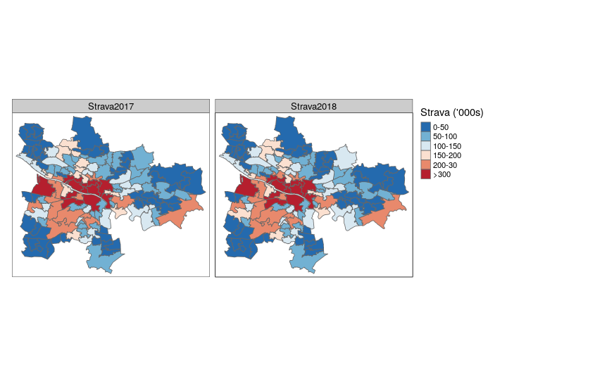
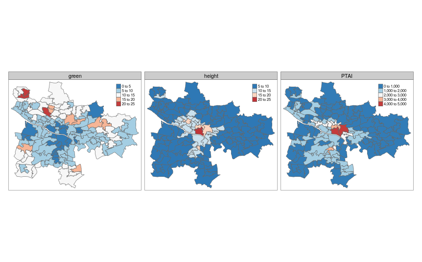
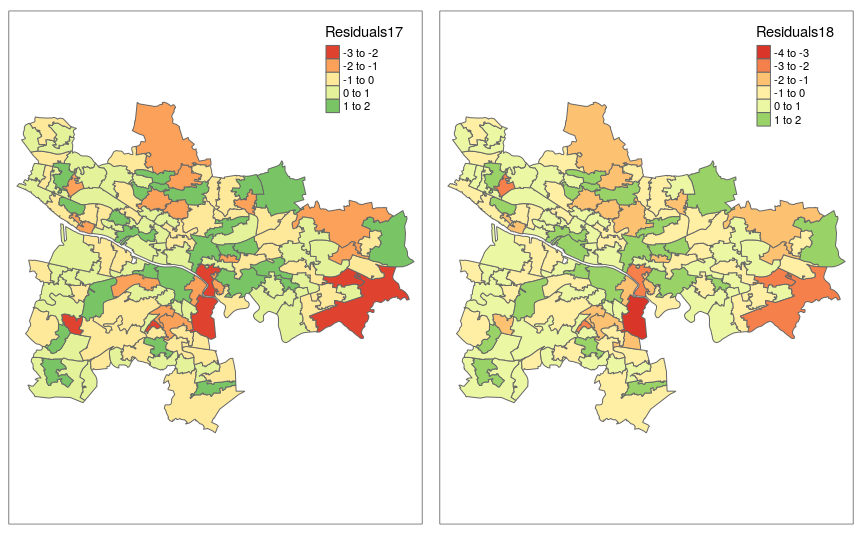
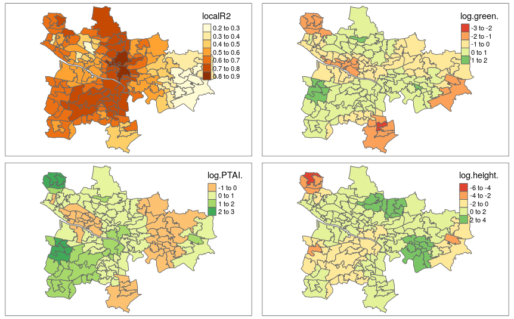
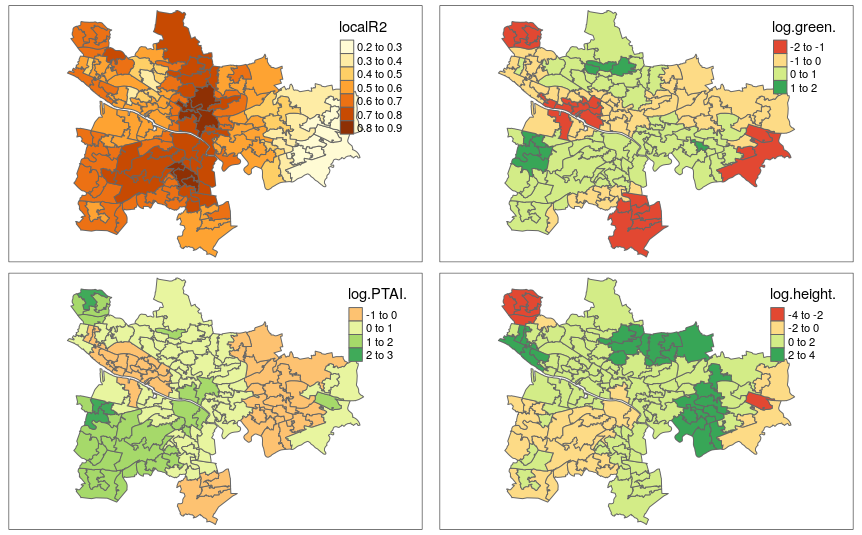

```{r setup, include=FALSE}
knitr::opts_chunk$set(echo = TRUE)
def.chunk.hook  <- knitr::knit_hooks$get("chunk")
knitr::knit_hooks$set(chunk = function(x, options) {
  x <- def.chunk.hook(x, options)
  ifelse(options$size != "normalsize", paste0("\n \\", options$size,"\n\n", x, "\n\n \\normalsize"), x)
})
```

```{r logo, eval=TRUE, echo=FALSE, message=FALSE, fig.align='center', out.width='0.3\\linewidth', fig.pos='H'}
temp <- tempfile(fileext = ".pdf")
download.file(url = "https://reproducible-agile.github.io/public/images/reproducible-AGILE-logo-square.pdf", destfile = temp)
knitr::include_graphics(temp)
```

This report is part of the reproducibility review at the AGILE conference.
For more information see [https://reproducible-agile.github.io/](https://reproducible-agile.github.io/).
This document is published on OSF at OSF **INSERT LINK HERE**.
To cite the report use

# Reviewed paper

> Hyesop Shin, Ana Basiri and Costanza Cagnina. Does the Built Environment Increase Active Travel?: Utilising Strava Bike Data and Geographically Weighted Models

# Summary

The authors provide all the data and code in their GitHub repository. From a fresh install of R, the software environment is easily set up. The authors provide one R script and one computational notebook, which could be executed successfully to create all the paper's figures.

\clearpage

# Reproducibility reviewer notes

## 1. Fork repository

Fork the authors' [repository](https://github.com/dataandcrowd/AGILE2022) into reproducible agile [repository](https://github.com/reproducible-agile/AGILE2022-16)

## 2. Prepare R environment

As mentioned by the authors in their GitHub repository, the R version is 4.1.3. To maintain the proper functioning of potential others R projects, I used a docker image built by the [Rocker Project](https://www.rocker-project.org/). The image `rocker/rstudio:4.1.3` contains an RStudio server with R version 4.1.3.

```{bash docker, eval=FALSE, size="tiny"}
sudo docker run -e ROOT=true -e PASSWORD=agile --rm -p 8787:8787 rocker/rstudio:4.1.3
```

When the Docker container is started, I connect to RStudio with a web browser: [http://localhost:8787](http://localhost:8787), with credentials as follows:

+ login: rstudio
+ password: agile

## 3. Install system libraries

In the containerised RStudio, I go to the **"Terminal"** tab and add copy paste these instructions to install system dependencies of required R packages.

```{bash apt, eval=FALSE, size="tiny"}
sudo apt update
sudo apt install libudunits2-dev # for sf package
sudo apt install libgdal-dev # for sf package
sudo apt install libgeos-dev libproj-dev libfontconfig1-dev # for tmap package
sudo apt install r-base-dev r-cran-sf r-cran-raster r-cran-rjava # for tmap package
```

## 4. Install R packages

In the containerised RStudio, I go to the **"Console"** tab and add copy paste these instructions.

```{R renv, eval=FALSE, size="tiny"}
# If you don't use docker
# install.packages(renv)
# renv::init()
# renv::activate()
#
install.packages("tidyverse")
install.packages("sf")
install.packages("tmap")
install.packages("spgwr")
install.packages("spdep")
```

## 5. Download the code

In the containerised RStudio, I go to the **"Terminal"** tab and add copy paste these instructions.

```{bash gitclone, eval=FALSE, size="tiny"}
git clone https://github.com/reproducible-agile/AGILE2022-16
cd AGILE2022-16
```

## 6. Start reproduction

In the containerised RStudio, I go to the **"Console"** tab and add copy paste these instructions.

```{R launch, eval=FALSE, size="tiny"}
setwd("~/AGILE2022-16")
source("AGILE2022.R")
```

There was an error at the first execution of the script:

```{R error, eval=FALSE, size="tiny"}
Error in loadNamespace(x) : there is no package called ‘car’
In addition: Warning message:
In grSoftVersion() :
  unable to load shared object '/usr/local/lib/R/modules//R_X11.so':
  libXt.so.6: cannot open shared object file: No such file or directory
```

To fix this issue, the package "car" has to be installed.

```{R car, eval=FALSE, size="tiny"}
install.packages("car")
```

## 7. Execute workflow

```{R launch2, eval=FALSE, size="tiny"}
source("AGILE2022.R")
Rows: 136 Columns: 3                                                                                                                                        
Column specification
Delimiter: ","
chr (1): Name
dbl (2): ride17, ride18

 Use `spec()` to retrieve the full column specification for this data.
 Specify the column types or set `show_col_types = FALSE` to quiet this message.
Rows: 136 Columns: 2                                                                                                                                        
 Column specification
Delimiter: ","
chr (1): Name
dbl (1): green

 Use `spec()` to retrieve the full column specification for this data.
 Specify the column types or set `show_col_types = FALSE` to quiet this message.
Rows: 136 Columns: 2                                                                                                                                        
 Column specification 
Delimiter: ","
chr (1): Name
dbl (1): PTAI

 Use `spec()` to retrieve the full column specification for this data.
 Specify the column types or set `show_col_types = FALSE` to quiet this message.
Rows: 136 Columns: 2                                                                                                                                        
 Column specification 
Delimiter: ","
chr (1): Name
dbl (1): height

 Use `spec()` to retrieve the full column specification for this data.
 Specify the column types or set `show_col_types = FALSE` to quiet this message.
Bandwidth: 8649.304 CV score: 145.982 
Bandwidth: 13980.9 CV score: 145.979 
Bandwidth: 17276 CV score: 145.8037 
Bandwidth: 19312.49 CV score: 145.7206 
Bandwidth: 20571.1 CV score: 145.678 
Bandwidth: 21348.97 CV score: 145.6545 
Bandwidth: 21829.72 CV score: 145.6409 
Bandwidth: 22126.84 CV score: 145.6329 
Bandwidth: 22310.47 CV score: 145.6281 
Bandwidth: 22423.96 CV score: 145.6251 
Bandwidth: 22494.1 CV score: 145.6233 
Bandwidth: 22537.45 CV score: 145.6222 
Bandwidth: 22564.24 CV score: 145.6216 
Bandwidth: 22580.8 CV score: 145.6211 
Bandwidth: 22591.03 CV score: 145.6209 
Bandwidth: 22597.36 CV score: 145.6207 
Bandwidth: 22601.27 CV score: 145.6206 
Bandwidth: 22603.68 CV score: 145.6206 
Bandwidth: 22605.18 CV score: 145.6205 
Bandwidth: 22606.1 CV score: 145.6205 
Bandwidth: 22606.67 CV score: 145.6205 
Bandwidth: 22607.02 CV score: 145.6205 
Bandwidth: 22607.24 CV score: 145.6205 
Bandwidth: 22607.37 CV score: 145.6205 
Bandwidth: 22607.46 CV score: 145.6205 
Bandwidth: 22607.51 CV score: 145.6205 
Bandwidth: 22607.54 CV score: 145.6205 
Bandwidth: 22607.56 CV score: 145.6205 
Bandwidth: 22607.57 CV score: 145.6205 
Bandwidth: 22607.58 CV score: 145.6205 
Bandwidth: 22607.58 CV score: 145.6205 
Bandwidth: 22607.59 CV score: 145.6205 
Bandwidth: 22607.59 CV score: 145.6205 
Bandwidth: 22607.59 CV score: 145.6205 
Bandwidth: 22607.59 CV score: 145.6205 
Bandwidth: 22607.59 CV score: 145.6205 
Bandwidth: 22607.59 CV score: 145.6205 
Adaptive q: 0.381966 CV score: 142.0616 
Adaptive q: 0.618034 CV score: 143.3678 
Adaptive q: 0.236068 CV score: 139.4898 
Adaptive q: 0.145898 CV score: 134.2445 
Adaptive q: 0.09016994 CV score: 125.9838 
Adaptive q: 0.05572809 CV score: 120.7797 
Adaptive q: 0.03444185 CV score: 116.7516 
Adaptive q: 0.02128624 CV score: 116.2329 
Adaptive q: 0.0233313 CV score: 115.6423 
Adaptive q: 0.02719672 CV score: 115.7782 
Adaptive q: 0.02480776 CV score: 115.535 
Adaptive q: 0.0248742 CV score: 115.5361 
Adaptive q: 0.02470378 CV score: 115.5343 
Adaptive q: 0.02466309 CV score: 115.5343 
Adaptive q: 0.0246224 CV score: 115.5344 
Adaptive q: 0.02466309 CV score: 115.5343 
Bandwidth: 8649.304 CV score: 142.8761 
Bandwidth: 13980.9 CV score: 143.0718 
Bandwidth: 5354.199 CV score: 139.7491 
Bandwidth: 3317.712 CV score: 130.526 
Bandwidth: 2059.094 CV score: 118.1944 
Bandwidth: 1281.226 CV score: 118.5905 
Bandwidth: 1720.457 CV score: 115.8141 
Bandwidth: 1684.992 CV score: 115.7301 
Bandwidth: 1607.77 CV score: 115.7045 
Bandwidth: 1483.041 CV score: 116.1778 
Bandwidth: 1637.192 CV score: 115.6875 
Bandwidth: 1637.647 CV score: 115.6875 
Bandwidth: 1637.256 CV score: 115.6875 
Bandwidth: 1637.253 CV score: 115.6875 
Bandwidth: 1637.253 CV score: 115.6875 
Bandwidth: 1637.253 CV score: 115.6875 
Bandwidth: 1637.253 CV score: 115.6875 
Adaptive q: 0.381966 CV score: 138.8295 
Adaptive q: 0.618034 CV score: 140.5099 
Adaptive q: 0.236068 CV score: 136.1478 
Adaptive q: 0.145898 CV score: 131.5708 
Adaptive q: 0.09016994 CV score: 124.8027 
Adaptive q: 0.05572809 CV score: 122.1225 
Adaptive q: 0.03444185 CV score: 119.9508 
Adaptive q: 0.02128624 CV score: 122.0017 
Adaptive q: 0.03827299 CV score: 120.0087 
Adaptive q: 0.03560744 CV score: 119.9427 
Adaptive q: 0.03544382 CV score: 119.9438 
Adaptive q: 0.03662559 CV score: 119.9341 
Adaptive q: 0.03725484 CV score: 119.9401 
Adaptive q: 0.03650315 CV score: 119.9354 
Adaptive q: 0.03676456 CV score: 119.9324 
Adaptive q: 0.03695183 CV score: 119.9334 
Adaptive q: 0.03680959 CV score: 119.9324 
Adaptive q: 0.03685028 CV score: 119.9325 
Adaptive q: 0.03680959 CV score: 119.9324 
Warning messages:
1: In gwr.sel(log(ride17) ~ log(green) + log(PTAI) + log(height), data = glasgow_sp,  :
  Bandwidth converged to upper bound:22607.5910919843
2: In proj4string(data) :
  CRS object has comment, which is lost in output; in tests, see
https://cran.r-project.org/web/packages/sp/vignettes/CRS_warnings.html
3: In proj4string(data) :
  CRS object has comment, which is lost in output; in tests, see
https://cran.r-project.org/web/packages/sp/vignettes/CRS_warnings.html
4: In proj4string(data) :
  CRS object has comment, which is lost in output; in tests, see
https://cran.r-project.org/web/packages/sp/vignettes/CRS_warnings.html
5: In proj4string(data) :
  CRS object has comment, which is lost in output; in tests, see
https://cran.r-project.org/web/packages/sp/vignettes/CRS_warnings.html
```

```{r screenshot1a, echo=FALSE, out.width="50%", fig.align='center', fig.cap="First figure generated by AGILE2022.R: Correlation of Strava 2017 against Strava 2018. However this figure is not part of the paper"}

```

```{r screenshot1b, echo=FALSE, out.width="50%", fig.align='center', fig.cap="2nd figure generated by AGILE2022.R. However this figure is not part of the paper"}

```

With the script `AGILE2022.R`, initially none of the 6 figures were reproduced.
After discussion with the authors, it appears that users can reproduce all the figures (6/6) by uncommenting the following lines: 

+ [line 49](https://github.com/reproducible-agile/AGILE2022-16/blob/main/AGILE2022.R#L49): Figure 1. Histogram og the variables
+ [line 66](https://github.com/reproducible-agile/AGILE2022-16/blob/main/AGILE2022.R#L66): Figure 2. Distribution of Strava Counts
+ [line 80](https://github.com/reproducible-agile/AGILE2022-16/blob/main/AGILE2022.R#L80): Figure 3. Distribution of Variables: %Green spaces, PTAI, and Average Buidling Heights
+ [line 128 and 129](https://github.com/reproducible-agile/AGILE2022-16/blob/main/AGILE2022.R#L128): Figure 4. OLS residuals for the response variables. Morans’I for both residuals computed for 0.36 (weak clustering)
+ [line 195](https://github.com/reproducible-agile/AGILE2022-16/blob/main/AGILE2022.R#L195): Figure 5. Estimated Coefficients of Strava Cycling (2017) and the Environmental Variables
+ [line 252](https://github.com/reproducible-agile/AGILE2022-16/blob/main/AGILE2022.R#L252): Figure 6. Estimated Coefficients of Strava Cycling (2018) and the Environmental Variables

## 8. Run render function on index.qmd

5 more figures have been generated with the notebook file `index.qmd`. They all correspond to the figures in the paper. Only the first figure of the paper (Histogram of the variables) is not reproducible with the script.

```{r screenshot3, echo=FALSE, out.width="50%", fig.align='center', fig.cap="Index.qmd: distribution of Strava Counts. Reproduction of Fig 2."}

```

```{r screenshot4, echo=FALSE, out.width="50%", fig.align='center', fig.cap="Index.qmd: Distribution of Variables: percent Green spaces, PTAI, and Average Building Height. Reproduction of Fig 3."}

```

```{r screenshot6, echo=FALSE, out.width="50%", fig.align='center', fig.cap="Index.qmd: OLS residuals for the response variables. Morans’I for both residuals computed for 0.36 (weak clustering). Reproduction of Fig 4."}

```

```{r screenshot7, echo=FALSE, out.width="50%", fig.align='center', fig.cap="Index.qmd: Estimated Coefficients of Strava Cycling (2017) and the Environmental Variables. Reproduction of Fig 5."}

```

```{r screenshot8, echo=FALSE, out.width="50%", fig.align='center', fig.cap="Index.qmd: Estimated Coefficients of Strava Cycling (2018) and the Environmental Variables. Reproduction of Fig 6."}

```

# Comments to the authors

- The README.md should be completed by:
  - ~~Instructions for package installation~~ changed by the authors
  - The package "car" is missing
  - ~~[The link to the website generated by Quarto and hosted on GitHub is broken](https://dataandcrowd.github.io/AGILE2022/index.html)~~ changed by the authors
- The authors should add a section in the `README.md` explaining how to easily set up a R environment compatible with this code. Users could use a Docker image built by the [Rocker Project](https://www.rocker-project.org/) as used in this report.
- The authors should uncomment the lines to automatically save all the plots.
