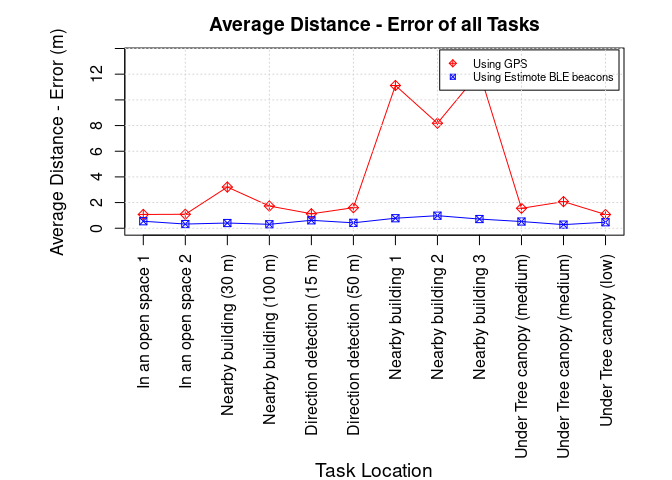
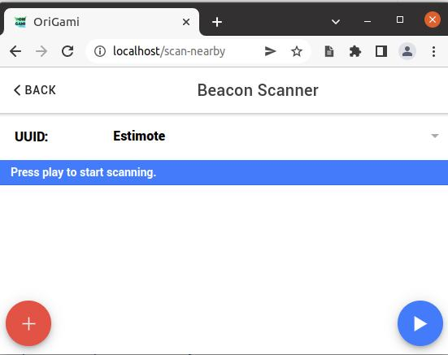

```{r setup, include=FALSE}
knitr::opts_chunk$set(echo = TRUE)

def.chunk.hook  <- knitr::knit_hooks$get("chunk")
knitr::knit_hooks$set(chunk = function(x, options) {
  x <- def.chunk.hook(x, options)
  ifelse(options$size != "normalsize", paste0("\n \\", options$size,"\n\n", x, "\n\n \\normalsize"), x)
})
```

```{r logo, eval=TRUE, echo=FALSE, message=FALSE, fig.align='center', out.width='0.3\\linewidth', fig.pos='H'}
temp <- tempfile(fileext = ".pdf")
download.file(url = "https://reproducible-agile.github.io/public/images/reproducible-AGILE-logo-square.pdf", destfile = temp)
knitr::include_graphics(temp)
```

This report is part of the reproducibility review at the AGILE conference.
For more information see [https://reproducible-agile.github.io/](https://reproducible-agile.github.io/).
This document is published on OSF at https://osf.io/8b7mr/.
To cite the report use

> _TODO_

# Reviewed paper

> _TODO_

# Summary

The article present an experimental evaluation of a positioning system.
Naturally, the physical/practical experiments could not be reproduced as part of this check of the computational reproducibility.
However, the one figure in the article that is based on the data from the experiment, as well as the software for running the experiment shown in screenshots in the paper could be reproduced by me.
With respect to the computational aspects and data visualisation, the given paper is reproducible.

\clearpage

# Reproducibility reviewer notes

After a brief initial evaluation and contact, the authors quickly provided updated links and documentation to the required software and data, and even updated the manuscript accordingly.

## Figure 4

Data and code for reproducing Fig. 4 in Section 4.4 of the paper are available at <https://doi.org/10.17605/OSF.IO/E48HX>.
The OSF project only includes the GitHub repository at <https://github.com/YouQam/experimental-evaluation-ble-beacon> which I forked into the Reproducible AGILE organisation at the start of the reproducibility review: <https://github.com/reproducible-agile/experimental-evaluation-ble-beacon>

From there, the following steps renders the given Rmd document successfully:

```{bash, eval=FALSE}
git clone https://github.com/reproducible-agile/experimental-evaluation-ble-beacon
```

```{r reproduction, size="tiny"}
rmarkdown::render("experimental-evaluation-ble-beacon/Qamaz-etal-2022.Rmd")
```

```{r sessionInfo, size="scriptsize"}
sessionInfo()
```

The created document includes a figure that matches Figure 4 with the exception of plot margins and therefore the legend overlaps the graph.
It is shown below.

```{r fig4, size="tiny"}
file.copy("experimental-evaluation-ble-beacon/Qamaz-etal-2022_files/figure-gfm/unnamed-chunk-4-1.png",
          "figure4.png", overwrite = TRUE)

```

The provided Binder link does work, but only after manually installing missing packages, because the given `install.r` file seems not to be picked up (cf. [pull request](https://github.com/YouQam/experimental-evaluation-ble-beacon/pull/1)).
Then the created output is the same as in my own environment.

\newpage

## Experiment game

The given paper collects data with human participants based on a game call GeoGami, and the used version is available in a branch on GitHub at <https://github.com/origami-team/origami/tree/ibeacon_integration_v3>.
Compared to the regular codebase (<https://github.com/origami-team/origami/compare/ibeacon_integration_v3>) the branch does indeed seem to include code for communicating with beacons and creating a game variant based on beacons.
_Without access to the beacon hardware, it's not possible for me to fully evaluate this part of the research._
However, I'll see if I can build and run the game software at least.

The README includes documentation for building the app locally and for mobile operating systems.
I try the former, though the documentation is very sparse and stops with the install, lacking information on build and usage.

```{bash geogami-clone, eval=FALSE}
git clone https://github.com/origami-team/origami
cd origami
git checkout ibeacon_integration_v3
```

```{bash yarn, eval=FALSE}
$ docker run --rm -it -v $(pwd):/origami node:16-buster /bin/bash

# in the container (outputs abbreviated):
cd /origami/
yarn install
# [..]
yarn run build-browser
# [...]
```
There were problems with using the latest Node.js, `18`, but switching back to `16` did the trick:
The `build-browser` script in the `package.json` created a directory `www`.
Exploring this with a webserver:

```{bash www, eval=FALSE}
docker run --rm -p 80:80 -v $(pwd)/www:/usr/share/nginx/html nginx
```

Gives me the UI of the GeoGami game, including some settings for Beacons.

```{r screenshot-geogami}

```

Without access to the required hardware, there is no point in evaluating the app further, or to test builds for mobile operating systems.
The code and the UI though show that a system as described in the paper seems to have been actually built.

# Comments to the authors

- Good job, using Binder!
- Please consider creating a registration for your OSF project - only then the files from the GitHub repo are properly archived, see <https://osf.io/e48hx/registrations>
- Add GeoGami to the OSF project (before creating a registration) so that tool is also archived
- The "MIT" license given in the GitHub repository is not suitable for data; see, e.g., <https://opendatacommons.org/faq/licenses/>
- Fix your plot margins and figure size in the code
- GeoGami should have a proper citation (i.e., archive to Zenodo/Software Heritage and add suggested citation in README)
- Take advantage of the fact that you have an OSF repo and add additional information there, e.g., a screencast/video of the app or more screenshots than you could fit into the paper.

```{r, echo=FALSE, eval=FALSE, results='hide'}
# create ZIP of reproduction files and upload to OSF
library("zip")
library("here")

#zipfile <- here::here("022/reproreview-agile-2022-022.zip")
#file.remove(zipfile)
#zip::zipr(zipfile = zipfile,
#          files = c(here::here("005/Dockerfile")))

library("osfr") # See docs at https://docs.ropensci.org/osfr/
# OSF_PAT is in .Renviron in parent directory
# We cannot use osfr to create a new component (with osfr::osf_create_component(x = osfr::osf_retrieve_node("6k5fh"), ...) because that will set the storage location to outside Europe.

# retrieve project
project <- osfr::osf_retrieve_node("8b7mr")

# upload files
osfr::osf_upload(x = project,
                 conflicts = "overwrite",
                 path = c(list.files(here::here("022"),
                                     pattern = "reproreview-agile-.*(pdf$|Rmd$|zip$)",
                                     full.names = TRUE),
                          )
                 )
```
