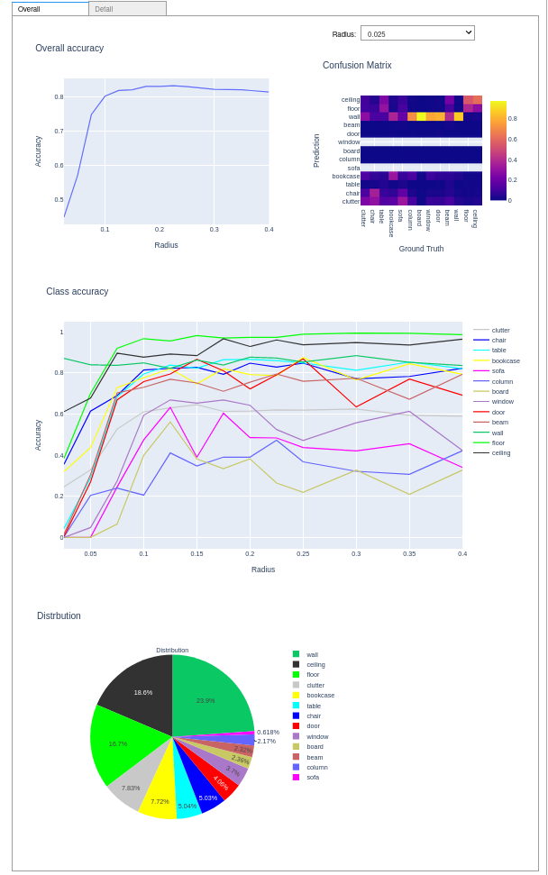
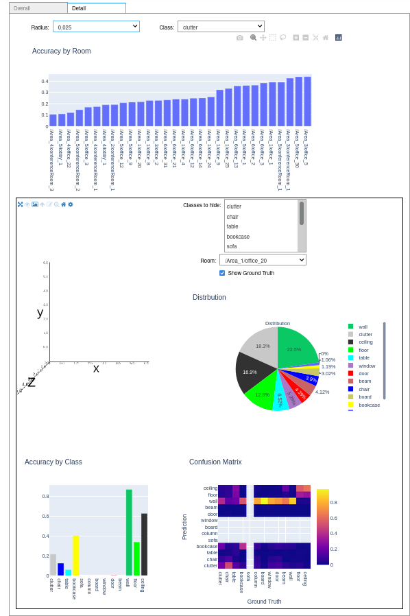

```{r setup, include=FALSE}
knitr::opts_chunk$set(echo = TRUE)
def.chunk.hook  <- knitr::knit_hooks$get("chunk")
knitr::knit_hooks$set(chunk = function(x, options) {
  x <- def.chunk.hook(x, options)
  ifelse(options$size != "normalsize", paste0("\n \\", options$size,"\n\n", x, "\n\n \\normalsize"), x)
})
```

```{r logo, eval=TRUE, echo=FALSE, message=FALSE, fig.align='center', out.width='0.3\\linewidth', fig.pos='H'}
temp <- tempfile(fileext = ".pdf")
download.file(url = "https://reproducible-agile.github.io/public/images/reproducible-AGILE-logo-square.pdf", destfile = temp)
knitr::include_graphics(temp)
```

This report is part of the reproducibility review at the AGILE conference.
For more information see [https://reproducible-agile.github.io/](https://reproducible-agile.github.io/).
This document is published on OSF at OSF **INSERT LINK HERE**.
To cite the report use

# Reviewed paper

> Guoray Cai and Yimu Pan. Understanding the Imperfection of 3D point Cloud and Semantic Segmentation algorithms for 3D Models of Indoor Environment

# Summary
The code and data provided by the authors allow to partially reproduce the section 4.4 (i.e. Interactive Exploration of Data Imperfection for Model Tuning) of the paper. The model training (PointNet++) and the input data for the section 4.4 are not reproducible by the provided code but the authors added a note, in the github repository of their project, explaining how the data was generated. Concerning the section 4.4 reproduction, 3 figures are fully reproducible (figs 5, 6, 7), 2 partially (figs 4, 8) and 4 are not (figs 3, 9, 10, 11). For figure 4, it seems that the provided data are not complete (some classes have missing data). The component D (i.e. "Ground Truth") of figure 8 is also missing.

\clearpage

# Reproducibility reviewer notes
## Download data and code
The code is accessible through github:
```{bash github,  eval=FALSE, size="tiny"}
git clone https://github.com/gxc26/PointClouds.git
cd PointClouds
```
As the datafile is a large file, authors provide a link to download it. The [link could be retrieve from the github repository](https://github.com/gxc26/PointClouds/blob/main/Link%20to%20datafile%20download). Authors should ensure that this link is permanent, otherwise the reproducibility will no longer be assured.

## Prepare the reproducibility environment
<!-- 1. Create a conda environment with the authors environment file:  -->

<!-- ```{bash conda,  eval=FALSE, size="tiny"}  -->
<!-- conda env create -f PtClouds.yaml --name agile-repro-24 -->
<!-- conda activate agile-repro-24 -->
<!-- ``` -->

<!-- I manualy removed all build number (but kept version number). -->

<!-- 2. Some packages could not be installed: -->

<!-- The error message from conda was -->
<!-- ```{bash condaerror,  eval=FALSE, size="tiny"} -->
<!-- ResolvePackageNotFound:  -->
<!--   - appnope=0.1.2 -->
<!--   - llvm-openmp=12.0.0 -->
<!--   - intel-openmp=2022.0.0 -->
<!--   - libgfortran=3.0.1 -->
<!-- ``` -->

<!-- I tried to remove the version for these 4 packages. See ["PtClouds_agile_review.yaml"](./PtClouds_agile_review.yaml) -->

The github repository has an environment file provided. I tried to create a conda environment using this file but it failed.
```{bash conda,  eval=FALSE, size="tiny"}
conda env create -f PtClouds.yaml --name agile-repro-24
Collecting package metadata (repodata.json): done
Solving environment: failed

ResolvePackageNotFound: 
  - sqlite==3.33.0=hffcf06c_0
  - python==3.6.10=hfe9666f_1
  - pywavelets==1.1.1=py36haf1e3a3_2
  - expat==2.4.4=he9d5cce_0
  - libcxx==12.0.0=h2f01273_0
  - kiwisolver==1.3.1=py36h23ab428_0
  - libffi==3.2.1=h0a44026_1007
  - cryptography==3.4.6=py36h2fd3fbb_0
  - xz==5.2.5=h1de35cc_0
  - poppler-data==0.4.11=hecd8cb5_0
  - libcurl==7.67.0=h051b688_0
  - tk==8.6.11=h7bc2e8c_0
  - tornado==6.1=py36h9ed2024_0
  - ncurses==6.3=hca72f7f_2
  - xerces-c==3.2.3=h48eee30_0
  - bzip2==1.0.8=h1de35cc_0
  - libgfortran==3.0.1=h93005f0_2
  - scikit-learn==0.24.2=py36hb2f4e1b_0
  - curl==7.67.0=ha441bb4_0
  - cligj==0.7.2=py36hecd8cb5_0
  - libedit==3.1.20210910=hca72f7f_0
  - fiona==1.8.4=py36h9a122fd_0
  - zlib==1.2.11=h4dc903c_4
  - matplotlib-base==3.3.4=py36h8b3ea08_0
  - libspatialite==4.3.0a=h644ec7d_19
  - glib==2.63.1=hd977a24_0
  - lz4-c==1.9.3=h23ab428_1
  - libboost==1.73.0=hd4c2dcd_11
  - msgpack-python==1.0.2=py36hf7b0b51_1
  - pyrsistent==0.17.3=py36haf1e3a3_0
  - brotlipy==0.7.0=py36h9ed2024_1003
  - shapely==1.6.4=py36he8793f5_0
  - freexl==1.0.6=h9ed2024_0
  - cytoolz==0.11.0=py36haf1e3a3_0
  - kealib==1.4.7=hf5ed860_6
  - libssh2==1.9.0=ha12b0ac_1
  - icu==58.2=h0a44026_3
  - libxslt==1.1.34=h83b36ba_0
  - mkl==2019.4=233
  - pixman==0.40.0=h9ed2024_1
  - geos==3.7.1=h0a44026_0
  - mistune==0.8.4=py36h1de35cc_0
  - scikit-image==0.16.2=py36h4f17bb1_0
  - libpng==1.6.37=ha441bb4_0
  - jupyter_core==4.8.1=py36hecd8cb5_0
  - libdap4==3.19.1=h3d3e54a_0
  - scipy==1.5.2=py36h912ce22_0
  - pandoc==2.12=hecd8cb5_0
  - pyproj==1.9.6=py36h9c430a6_0
  - appnope==0.1.2=py36hecd8cb5_1001
  - pip==21.2.2=py36hecd8cb5_0
  - pysocks==1.7.1=py36hecd8cb5_0
  - readline==7.0=h1de35cc_5
  - cffi==1.14.0=py36hb5b8e2f_0
  - hdf4==4.2.13=h39711bb_2
  - pcre==8.45=h23ab428_0
  - argon2-cffi==20.1.0=py36h9ed2024_1
  - libiconv==1.16=h1de35cc_0
  - rtree==0.9.7=py36hecd8cb5_1
  - lxml==4.6.3=py36h26b266a_0
  - zeromq==4.3.4=h23ab428_0
  - traitlets==4.3.3=py36hecd8cb5_0
  - proj4==5.2.0=h0a44026_1
  - giflib==5.1.4=h1de35cc_1
  - libtiff==4.2.0=h87d7836_0
  - setuptools==58.0.4=py36hecd8cb5_0
  - mkl-service==2.3.0=py36h9ed2024_0
  - matplotlib==3.3.4=py36hecd8cb5_0
  - pillow==8.1.2=py36h5270095_0
  - terminado==0.9.4=py36hecd8cb5_0
  - markupsafe==2.0.1=py36h9ed2024_0
  - openssl==1.1.1m=hca72f7f_0
  - docutils==0.17.1=py36hecd8cb5_1
  - krb5==1.16.4=hddcf347_0
  - libnetcdf==4.6.1=hd5207e6_2
  - gettext==0.21.0=h7535e17_0
  - libgdal==2.3.3=h0950a36_0
  - mkl_random==1.1.1=py36h959d312_0
  - pandas==1.1.5=py36hb2f4e1b_0
  - jpeg==9d=h9ed2024_0
  - libpq==11.2=h051b688_0
  - mkl_fft==1.3.0=py36ha059aab_0
  - llvm-openmp==12.0.0=h0dcd299_1
  - lcms2==2.12=hf1fd2bf_0
  - cairo==1.14.12=hc4e6be7_4
  - libspatialindex==1.9.3=h23ab428_0
  - notebook==6.2.0=py36hecd8cb5_0
  - libxml2==2.9.12=hcdb78fc_0
  - openjpeg==2.4.0=h66ea3da_0
  - poppler==0.65.0=ha097c24_1
  - json-c==0.13.1=h3efe00b_0
  - libwebp-base==1.2.2=hca72f7f_0
  - gdal==2.3.3=py36hbe65578_0
  - numpy-base==1.17.0=py36h6575580_0
  - zstd==1.4.9=h322a384_0
  - ca-certificates==2022.2.1=hecd8cb5_0
  - fontconfig==2.13.1=ha9ee91d_0
  - numpy==1.17.0=py36hacdab7b_0
  - pyzmq==22.2.1=py36h23ab428_1
  - libkml==1.3.0=h952ee91_5
  - libsodium==1.0.18=h1de35cc_0
  - intel-openmp==2022.0.0=hecd8cb5_3615
  - certifi==2020.12.5=py36hecd8cb5_0
  - hdf5==1.10.4=hfa1e0ec_0
  - freetype==2.11.0=hd8bbffd_0
```
After some exchanges with the authors, they sent us another environment file by email.
```{bash conda2,  eval=FALSE, size="tiny"}
conda env create -f Ptclouds1.yml --name agile-repro-24
Collecting package metadata (repodata.json): done
Solving environment: done

Downloading and Extracting Packages
bzip2-1.0.8          | 78 KB     | ######################################################################################################################################################################## | 100% 
docutils-0.17.1      | 687 KB    | ######################################################################################################################################################################## | 100% 
pillow-8.3.1         | 637 KB    | ######################################################################################################################################################################## | 100% 
pyrsistent-0.17.3    | 89 KB     | ######################################################################################################################################################################## | 100% 
olefile-0.46         | 48 KB     | ######################################################################################################################################################################## | 100% 
joblib-1.0.1         | 208 KB    | ######################################################################################################################################################################## | 100% 
intel-openmp-2022.0. | 4.2 MB    | ######################################################################################################################################################################## | 100% 
xz-5.2.5             | 339 KB    | ######################################################################################################################################################################## | 100% 
zstd-1.4.9           | 480 KB    | ######################################################################################################################################################################## | 100% 
testpath-0.5.0       | 81 KB     | ######################################################################################################################################################################## | 100% 
libkml-1.3.0         | 573 KB    | ######################################################################################################################################################################## | 100% 
cligj-0.7.2          | 13 KB     | ######################################################################################################################################################################## | 100% 
pyyaml-5.4.1         | 170 KB    | ######################################################################################################################################################################## | 100% 
entrypoints-0.3      | 12 KB     | ######################################################################################################################################################################## | 100% 
pip-21.2.2           | 1.8 MB    | ######################################################################################################################################################################## | 100% 
pythreejs-2.3.0      | 2.6 MB    | ######################################################################################################################################################################## | 100% 
munch-2.5.0          | 13 KB     | ######################################################################################################################################################################## | 100% 
nbconvert-6.0.7      | 480 KB    | ######################################################################################################################################################################## | 100% 
pycparser-2.21       | 94 KB     | ######################################################################################################################################################################## | 100% 
fontconfig-2.13.1    | 250 KB    | ######################################################################################################################################################################## | 100% 
setuptools-58.0.4    | 788 KB    | ######################################################################################################################################################################## | 100% 
wcwidth-0.2.5        | 26 KB     | ######################################################################################################################################################################## | 100% 
glib-2.69.1          | 1.7 MB    | ######################################################################################################################################################################## | 100% 
zlib-1.2.12          | 106 KB    | ######################################################################################################################################################################## | 100% 
terminado-0.9.4      | 25 KB     | ######################################################################################################################################################################## | 100% 
libboost-1.73.0      | 13.9 MB   | ######################################################################################################################################################################## | 100% 
lxml-4.6.3           | 1.2 MB    | ######################################################################################################################################################################## | 100% 
numpy-devel-1.18.5   | 26 KB     | ######################################################################################################################################################################## | 100% 
freetype-2.11.0      | 618 KB    | ######################################################################################################################################################################## | 100% 
pandocfilters-1.5.0  | 11 KB     | ######################################################################################################################################################################## | 100% 
scikit-image-0.16.2  | 23.1 MB   | ######################################################################################################################################################################## | 100% 
dbus-1.13.18         | 504 KB    | ######################################################################################################################################################################## | 100% 
openssl-1.1.1n       | 2.5 MB    | ######################################################################################################################################################################## | 100% 
geos-3.8.0           | 961 KB    | ######################################################################################################################################################################## | 100% 
cryptography-35.0.0  | 1.3 MB    | ######################################################################################################################################################################## | 100% 
pickleshare-0.7.5    | 13 KB     | ######################################################################################################################################################################## | 100% 
postgresql-12.9      | 3.8 MB    | ######################################################################################################################################################################## | 100% 
six-1.16.0           | 18 KB     | ######################################################################################################################################################################## | 100% 
libspatialite-4.3.0a | 2.1 MB    | ######################################################################################################################################################################## | 100% 
pandas-datareader-0. | 71 KB     | ######################################################################################################################################################################## | 100% 
certifi-2021.5.30    | 139 KB    | ######################################################################################################################################################################## | 100% 
charset-normalizer-2 | 35 KB     | ######################################################################################################################################################################## | 100% 
numpy-1.18.5         | 5 KB      | ######################################################################################################################################################################## | 100% 
tornado-6.1          | 581 KB    | ######################################################################################################################################################################## | 100% 
nbformat-5.1.3       | 44 KB     | ######################################################################################################################################################################## | 100% 
libedit-3.1.20210910 | 166 KB    | ######################################################################################################################################################################## | 100% 
idna-3.3             | 49 KB     | ######################################################################################################################################################################## | 100% 
pyparsing-3.0.4      | 81 KB     | ######################################################################################################################################################################## | 100% 
networkx-2.5         | 1.1 MB    | ######################################################################################################################################################################## | 100% 
pandas-1.1.5         | 8.2 MB    | ######################################################################################################################################################################## | 100% 
mkl_fft-1.3.0        | 170 KB    | ######################################################################################################################################################################## | 100% 
aws-c-common-0.4.57  | 156 KB    | ######################################################################################################################################################################## | 100% 
imagesize-1.3.0      | 9 KB      | ######################################################################################################################################################################## | 100% 
requests-2.27.1      | 54 KB     | ######################################################################################################################################################################## | 100% 
ld_impl_linux-64-2.3 | 586 KB    | ######################################################################################################################################################################## | 100% 
libspatialindex-1.9. | 2.1 MB    | ######################################################################################################################################################################## | 100% 
backcall-0.2.0       | 13 KB     | ######################################################################################################################################################################## | 100% 
sqlite-3.38.3        | 1.0 MB    | ######################################################################################################################################################################## | 100% 
geotiff-1.6.0        | 239 KB    | ######################################################################################################################################################################## | 100% 
msgpack-numpy-0.4.7. | 10 KB     | ######################################################################################################################################################################## | 100% 
libev-4.33           | 111 KB    | ######################################################################################################################################################################## | 100% 
blas-1.0             | 6 KB      | ######################################################################################################################################################################## | 100% 
sip-4.19.8           | 274 KB    | ######################################################################################################################################################################## | 100% 
typing_extensions-4. | 28 KB     | ######################################################################################################################################################################## | 100% 
mistune-0.8.4        | 55 KB     | ######################################################################################################################################################################## | 100% 
treeinterpreter-0.2. | 9 KB      | ######################################################################################################################################################################## | 100% 
libtiff-4.2.0        | 502 KB    | ######################################################################################################################################################################## | 100% 
nest-asyncio-1.5.1   | 10 KB     | ######################################################################################################################################################################## | 100% 
pcre-8.45            | 207 KB    | ######################################################################################################################################################################## | 100% 
async_generator-1.10 | 39 KB     | ######################################################################################################################################################################## | 100% 
ipysheet-0.5.0       | 2.9 MB    | ######################################################################################################################################################################## | 100% 
libssh2-1.10.0       | 274 KB    | ######################################################################################################################################################################## | 100% 
ipython-7.16.1       | 999 KB    | ######################################################################################################################################################################## | 100% 
matplotlib-base-3.3. | 5.1 MB    | ######################################################################################################################################################################## | 100% 
cfitsio-3.470        | 814 KB    | ######################################################################################################################################################################## | 100% 
numpy-base-1.18.5    | 4.1 MB    | ######################################################################################################################################################################## | 100% 
jinja2-3.0.3         | 106 KB    | ######################################################################################################################################################################## | 100% 
jupyter_client-7.1.2 | 93 KB     | ######################################################################################################################################################################## | 100% 
ipywebrtc-0.6.0      | 187 KB    | ######################################################################################################################################################################## | 100% 
geopandas-base-0.9.0 | 919 KB    | ######################################################################################################################################################################## | 100% 
prometheus_client-0. | 47 KB     | ######################################################################################################################################################################## | 100% 
cairo-1.16.0         | 1.0 MB    | ######################################################################################################################################################################## | 100% 
libxslt-1.1.34       | 432 KB    | ######################################################################################################################################################################## | 100% 
pytz-2021.3          | 171 KB    | ######################################################################################################################################################################## | 100% 
python-dateutil-2.8. | 233 KB    | ######################################################################################################################################################################## | 100% 
hdf4-4.2.13          | 714 KB    | ######################################################################################################################################################################## | 100% 
notebook-6.4.3       | 4.2 MB    | ######################################################################################################################################################################## | 100% 
libgcc-ng-9.3.0      | 4.8 MB    | ######################################################################################################################################################################## | 100% 
_openmp_mutex-4.5    | 22 KB     | ######################################################################################################################################################################## | 100% 
pscript-0.7.5        | 58 KB     | ######################################################################################################################################################################## | 100% 
aws-checksums-0.1.9  | 49 KB     | ######################################################################################################################################################################## | 100% 
matplotlib-3.3.4     | 26 KB     | ######################################################################################################################################################################## | 100% 
libgfortran4-7.5.0   | 995 KB    | ######################################################################################################################################################################## | 100% 
jupyter_core-4.8.1   | 74 KB     | ######################################################################################################################################################################## | 100% 
libnghttp2-1.46.0    | 680 KB    | ######################################################################################################################################################################## | 100% 
attrs-21.4.0         | 51 KB     | ######################################################################################################################################################################## | 100% 
pysocks-1.7.1        | 31 KB     | ######################################################################################################################################################################## | 100% 
sphinxcontrib-htmlhe | 32 KB     | ######################################################################################################################################################################## | 100% 
urllib3-1.26.8       | 106 KB    | ######################################################################################################################################################################## | 100% 
pyproj-2.6.1.post1   | 390 KB    | ######################################################################################################################################################################## | 100% 
toolz-0.11.2         | 49 KB     | ######################################################################################################################################################################## | 100% 
bqplot-0.12.33       | 1.0 MB    | ######################################################################################################################################################################## | 100% 
click-plugins-1.1.1  | 10 KB     | ######################################################################################################################################################################## | 100% 
_libgcc_mutex-0.1    | 3 KB      | ######################################################################################################################################################################## | 100% 
kiwisolver-1.3.1     | 86 KB     | ######################################################################################################################################################################## | 100% 
libstdcxx-ng-9.3.0   | 3.1 MB    | ######################################################################################################################################################################## | 100% 
dask-core-2021.3.0   | 659 KB    | ######################################################################################################################################################################## | 100% 
yaml-0.2.5           | 75 KB     | ######################################################################################################################################################################## | 100% 
wheel-0.37.1         | 33 KB     | ######################################################################################################################################################################## | 100% 
jupyterlab_pygments- | 8 KB      | ######################################################################################################################################################################## | 100% 
geopandas-0.9.0      | 10 KB     | ######################################################################################################################################################################## | 100% 
jpeg-9e              | 240 KB    | ######################################################################################################################################################################## | 100% 
lz4-c-1.9.3          | 185 KB    | ######################################################################################################################################################################## | 100% 
libgdal-3.0.2        | 11.7 MB   | ######################################################################################################################################################################## | 100% 
mkl_random-1.1.1     | 327 KB    | ######################################################################################################################################################################## | 100% 
gdal-3.0.2           | 1.0 MB    | ######################################################################################################################################################################## | 100% 
ipython_genutils-0.2 | 27 KB     | ######################################################################################################################################################################## | 100% 
traittypes-0.2.1     | 10 KB     | ######################################################################################################################################################################## | 100% 
parso-0.8.3          | 70 KB     | ######################################################################################################################################################################## | 100% 
alabaster-0.7.12     | 18 KB     | ######################################################################################################################################################################## | 100% 
ca-certificates-2022 | 124 KB    | ######################################################################################################################################################################## | 100% 
xerces-c-3.2.3       | 2.4 MB    | ######################################################################################################################################################################## | 100% 
pexpect-4.8.0        | 53 KB     | ######################################################################################################################################################################## | 100% 
openjpeg-2.4.0       | 331 KB    | ######################################################################################################################################################################## | 100% 
libuuid-1.0.3        | 17 KB     | ######################################################################################################################################################################## | 100% 
expat-2.4.4          | 169 KB    | ######################################################################################################################################################################## | 100% 
colorama-0.4.4       | 21 KB     | ######################################################################################################################################################################## | 100% 
pyqt-5.9.2           | 4.5 MB    | ######################################################################################################################################################################## | 100% 
ipykernel-5.3.4      | 181 KB    | ######################################################################################################################################################################## | 100% 
pywavelets-1.1.1     | 3.5 MB    | ######################################################################################################################################################################## | 100% 
libpng-1.6.37        | 278 KB    | ######################################################################################################################################################################## | 100% 
pyzmq-22.2.1         | 454 KB    | ######################################################################################################################################################################## | 100% 
jupyterlab_widgets-1 | 109 KB    | ######################################################################################################################################################################## | 100% 
tenacity-8.0.1       | 38 KB     | ######################################################################################################################################################################## | 100% 
mapclassify-2.4.3    | 36 KB     | ######################################################################################################################################################################## | 100% 
ptyprocess-0.7.0     | 17 KB     | ######################################################################################################################################################################## | 100% 
krb5-1.19.2          | 1.2 MB    | ######################################################################################################################################################################## | 100% 
threadpoolctl-2.2.0  | 16 KB     | ######################################################################################################################################################################## | 100% 
prompt-toolkit-3.0.2 | 259 KB    | ######################################################################################################################################################################## | 100% 
poppler-0.81.0       | 9.2 MB    | ######################################################################################################################################################################## | 100% 
gst-plugins-base-1.1 | 4.9 MB    | ######################################################################################################################################################################## | 100% 
libxcb-1.14          | 505 KB    | ######################################################################################################################################################################## | 100% 
pygments-2.11.2      | 759 KB    | ######################################################################################################################################################################## | 100% 
sphinxcontrib-serial | 25 KB     | ######################################################################################################################################################################## | 100% 
mkl-service-2.3.0    | 52 KB     | ######################################################################################################################################################################## | 100% 
pixman-0.40.0        | 373 KB    | ######################################################################################################################################################################## | 100% 
freexl-1.0.6         | 42 KB     | ######################################################################################################################################################################## | 100% 
babel-2.9.1          | 5.5 MB    | ######################################################################################################################################################################## | 100% 
webencodings-0.5.1   | 19 KB     | ######################################################################################################################################################################## | 100% 
cffi-1.14.6          | 220 KB    | ######################################################################################################################################################################## | 100% 
widgetsnbextension-3 | 862 KB    | ######################################################################################################################################################################## | 100% 
json-c-0.13.1        | 64 KB     | ######################################################################################################################################################################## | 100% 
qt-5.9.7             | 68.5 MB   | ######################################################################################################################################################################## | 100% 
gstreamer-1.14.0     | 3.2 MB    | ######################################################################################################################################################################## | 100% 
jedi-0.17.0          | 780 KB    | ######################################################################################################################################################################## | 100% 
kealib-1.4.14        | 160 KB    | ######################################################################################################################################################################## | 100% 
c-ares-1.18.1        | 114 KB    | ######################################################################################################################################################################## | 100% 
libdap4-3.19.1       | 1.0 MB    | ######################################################################################################################################################################## | 100% 
libxml2-2.9.12       | 1.2 MB    | ######################################################################################################################################################################## | 100% 
tiledb-2.2.9         | 1.5 MB    | ######################################################################################################################################################################## | 100% 
bleach-4.1.0         | 123 KB    | ######################################################################################################################################################################## | 100% 
mkl-2020.2           | 138.3 MB  | ######################################################################################################################################################################## | 100% 
aws-sdk-cpp-1.8.185  | 1.9 MB    | ######################################################################################################################################################################## | 100% 
jsonschema-3.2.0     | 47 KB     | ######################################################################################################################################################################## | 100% 
cytoolz-0.11.0       | 329 KB    | ######################################################################################################################################################################## | 100% 
numpydoc-1.1.0       | 42 KB     | ######################################################################################################################################################################## | 100% 
readline-8.1.2       | 354 KB    | ######################################################################################################################################################################## | 100% 
markupsafe-2.0.1     | 21 KB     | ######################################################################################################################################################################## | 100% 
libwebp-base-1.2.2   | 440 KB    | ######################################################################################################################################################################## | 100% 
snowballstemmer-2.2. | 61 KB     | ######################################################################################################################################################################## | 100% 
tk-8.6.11            | 3.0 MB    | ######################################################################################################################################################################## | 100% 
pandoc-2.12          | 9.5 MB    | ######################################################################################################################################################################## | 100% 
click-7.1.2          | 64 KB     | ######################################################################################################################################################################## | 100% 
lcms2-2.12           | 312 KB    | ######################################################################################################################################################################## | 100% 
ipywidgets-7.6.5     | 105 KB    | ######################################################################################################################################################################## | 100% 
importlib-metadata-4 | 38 KB     | ######################################################################################################################################################################## | 100% 
sphinxcontrib-jsmath | 8 KB      | ######################################################################################################################################################################## | 100% 
nbclient-0.5.3       | 62 KB     | ######################################################################################################################################################################## | 100% 
defusedxml-0.7.1     | 23 KB     | ######################################################################################################################################################################## | 100% 
sphinxcontrib-devhel | 23 KB     | ######################################################################################################################################################################## | 100% 
shapely-1.7.1        | 392 KB    | ######################################################################################################################################################################## | 100% 
fiona-1.8.13.post1   | 728 KB    | ######################################################################################################################################################################## | 100% 
libgfortran-ng-7.5.0 | 22 KB     | ######################################################################################################################################################################## | 100% 
aws-c-event-stream-0 | 25 KB     | ######################################################################################################################################################################## | 100% 
traitlets-4.3.3      | 138 KB    | ######################################################################################################################################################################## | 100% 
brotlipy-0.7.0       | 320 KB    | ######################################################################################################################################################################## | 100% 
plotly-5.6.0         | 2.7 MB    | ######################################################################################################################################################################## | 100% 
ncurses-6.3          | 782 KB    | ######################################################################################################################################################################## | 100% 
poppler-data-0.4.11  | 2.1 MB    | ######################################################################################################################################################################## | 100% 
python-3.6.13        | 32.5 MB   | ######################################################################################################################################################################## | 100% 
sphinxcontrib-qthelp | 26 KB     | ######################################################################################################################################################################## | 100% 
cycler-0.11.0        | 12 KB     | ######################################################################################################################################################################## | 100% 
importlib_metadata-4 | 11 KB     | ######################################################################################################################################################################## | 100% 
ipyvolume-0.6.0a8    | 1.2 MB    | ######################################################################################################################################################################## | 100% 
libnetcdf-4.6.1      | 869 KB    | ######################################################################################################################################################################## | 100% 
scikit-learn-0.24.2  | 5.2 MB    | ######################################################################################################################################################################## | 100% 
proj-6.2.1           | 8.9 MB    | ######################################################################################################################################################################## | 100% 
libpq-12.9           | 2.1 MB    | ######################################################################################################################################################################## | 100% 
decorator-5.1.1      | 12 KB     | ######################################################################################################################################################################## | 100% 
curl-7.82.0          | 95 KB     | ######################################################################################################################################################################## | 100% 
libffi-3.3           | 50 KB     | ######################################################################################################################################################################## | 100% 
pyopenssl-22.0.0     | 50 KB     | ######################################################################################################################################################################## | 100% 
sphinx-4.4.0         | 1.2 MB    | ######################################################################################################################################################################## | 100% 
packaging-21.3       | 36 KB     | ######################################################################################################################################################################## | 100% 
msgpack-python-1.0.2 | 82 KB     | ######################################################################################################################################################################## | 100% 
ipydatawidgets-4.2.0 | 171 KB    | ######################################################################################################################################################################## | 100% 
zeromq-4.3.4         | 331 KB    | ######################################################################################################################################################################## | 100% 
cloudpickle-2.0.0    | 32 KB     | ######################################################################################################################################################################## | 100% 
libcurl-7.82.0       | 342 KB    | ######################################################################################################################################################################## | 100% 
icu-58.2             | 10.5 MB   | ######################################################################################################################################################################## | 100% 
imageio-2.9.0        | 3.0 MB    | ######################################################################################################################################################################## | 100% 
libgomp-9.3.0        | 311 KB    | ######################################################################################################################################################################## | 100% 
libsodium-1.0.18     | 244 KB    | ######################################################################################################################################################################## | 100% 
hdf5-1.10.6          | 3.7 MB    | ######################################################################################################################################################################## | 100% 
rtree-0.9.7          | 48 KB     | ######################################################################################################################################################################## | 100% 
sphinxcontrib-appleh | 29 KB     | ######################################################################################################################################################################## | 100% 
scipy-1.5.2          | 14.4 MB   | ######################################################################################################################################################################## | 100% 
argon2-cffi-20.1.0   | 46 KB     | ######################################################################################################################################################################## | 100% 
giflib-5.2.1         | 78 KB     | ######################################################################################################################################################################## | 100% 
zipp-3.6.0           | 17 KB     | ######################################################################################################################################################################## | 100% 
send2trash-1.8.0     | 19 KB     | ######################################################################################################################################################################## | 100% 
Preparing transaction: done
Verifying transaction: done
Executing transaction: | 

    Installed package of scikit-learn can be accelerated using scikit-learn-intelex.
    More details are available here: https://intel.github.io/scikit-learn-intelex

    For example:

        $ conda install scikit-learn-intelex
        $ python -m sklearnex my_application.py

    

done
#
# To activate this environment, use
#
#     $ conda activate agile-repro-24
#
# To deactivate an active environment, use
#
#     $ conda deactivate
```
After this successful installation, the authors update their github repository.

```{bash condagithub,  eval=FALSE, size="tiny"}
conda env create -f Ptclouds.yml --name agile-repro-24

Collecting package metadata (repodata.json): done
Solving environment: done

Downloading and Extracting Packages
libstdcxx-ng-11.2.0  | 4.7 MB    | ############################################################## | 100% 
_openmp_mutex-5.1    | 21 KB     | ############################################################## | 100% 
libxcb-1.15          | 505 KB    | ############################################################## | 100% 
libgomp-11.2.0       | 473 KB    | ############################################################## | 100% 
openssl-1.1.1o       | 2.5 MB    | ############################################################## | 100% 
libgcc-ng-11.2.0     | 5.3 MB    | ############################################################## | 100% 
ld_impl_linux-64-2.3 | 654 KB    | ############################################################## | 100% 
Preparing transaction: done
Verifying transaction: done
Executing transaction: | 

    Installed package of scikit-learn can be accelerated using scikit-learn-intelex.
    More details are available here: https://intel.github.io/scikit-learn-intelex

    For example:

        $ conda install scikit-learn-intelex
        $ python -m sklearnex my_application.py

    

done
#
# To activate this environment, use
#
#     $ conda activate agile-repro-24-2
#
# To deactivate an active environment, use
#
#     $ conda deactivate

```

Then I activate the environment and start jupyter notebook.
```{bash condaactivate,  eval=FALSE, size="tiny"}
conda activate agile-repro-24
jupyter notebook
```

### Run the jupyter notebook
All cells were executed successfully. The notebook generate 2 tabs of visualization.
```{r tab1, echo=FALSE, out.width="50%", fig.align='center', fig.cap="visual-exploration-dashboard-pt2.ipynb: Tab1. Reproduction of figures 5, 6 and 7"}

```

```{r tab2, echo=FALSE, out.width="50%", fig.align='center', fig.cap="visual-exploration-dashboard-pt2.ipynb: Tab2. Partially reproduction of figure 4."}

```

I notice differences between the figures from the paper and the figures generated by the code

- Figure 3 ("Stanford Large-Scale 3D Indoor Spaces Dataset (S3DIS)") is not generated by the code
- Figure 4 ("Point-level accuracy and error rates on semantic labeling"): 
  - some class are empty (Sofa, Column, Board, Windows, beam).
  - proportion of classes are different (all)
  It's maybe because there is a filter (from test_split.txt) on rooms. The file test_split.txt has 54 value whereas the paper used 272 rooms.
- Figure 5, 6, 7 are reproducible
- Figure 8 (Interactive Dashboard for Exploratory Semantic Segmentation): Ground truth is missing (component D)
- Figure 9, 10, 11 are not reproducible because they come from human annotation.


# Comments to the authors
- ~~Can not create conda environment using the env file (PtClouds.yaml) provided by the authors. I suggest to export without information about the build numbers (which are OS dependent).~~ The authors update their github repository with a correct env file. The installation works fine now. 
- We suggest to upload the data file ([pickle file](https://pennstateoffice365-my.sharepoint.com/:u:/g/personal/gxc26_psu_edu/ESTstxY2j_1CiTOiTl8ajt8BAVQmlsNT4AhpDZOvORGkxA?e=miJZJL)) into Zenodo. The link to the datafile have to be permanent otherwise the reproducibility may no longer be assured.
- The training of PointNet++ (Deep learning model) is not reproducible by the provided code. However, after a discussion with the authors, they added a note to their github repository explaining how the pickle file was generated:

```{bash ghnote,  eval=FALSE, size="tiny"}
	Run the PointNet++ semantic segmentation algorithm exactly as was done in the original paper Qi et al. (2017) 
	(see 	https://github.com/charlesq34/pointnet2/blob/master/README.md) on the 272 rooms in S3DIS data.   
	Do this 13 times to collect performance data on different radius values 
	r = [0.025, 0.05, 0.075, 0.1, 0.125, 0.15, 0.175, 0.2, 0.225, 0.25, 0.3, 0.35, 0.4].  
	The result would be 13 point level semantic labels for each 3D point that correspond to the 13 different radius setting.  
	These 13 values, together with the 3D coordinates and semantic ground truthfor each point are stored in the PICKLE file.  
	The PICKLE file also stores the room number of each 3D points. 
```

- As the authors use PointNet++, they should use the citation mentioned in [https://github.com/charlesq34/pointnet2/blob/master/README.md](https://github.com/charlesq34/pointnet2/blob/master/README.md)
- The authors github repository is missing a license.
